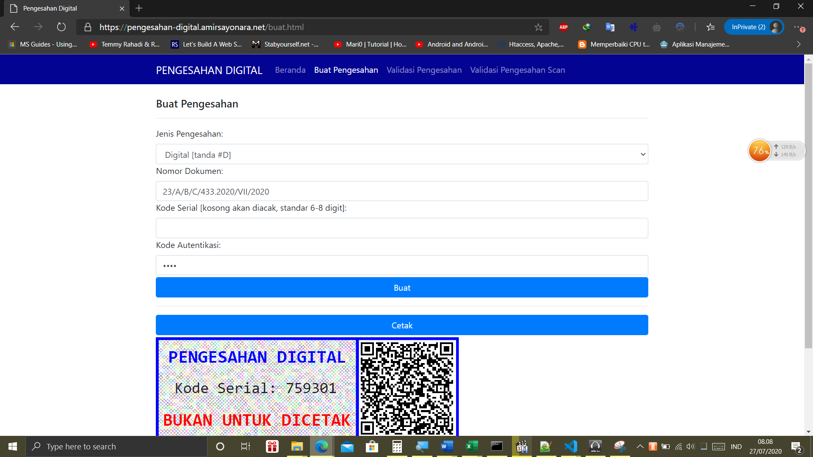
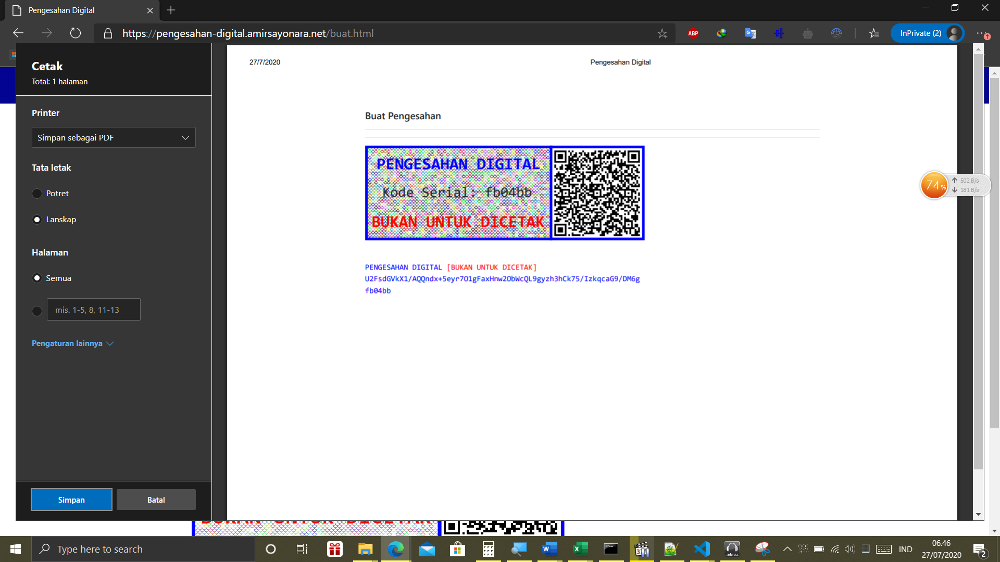
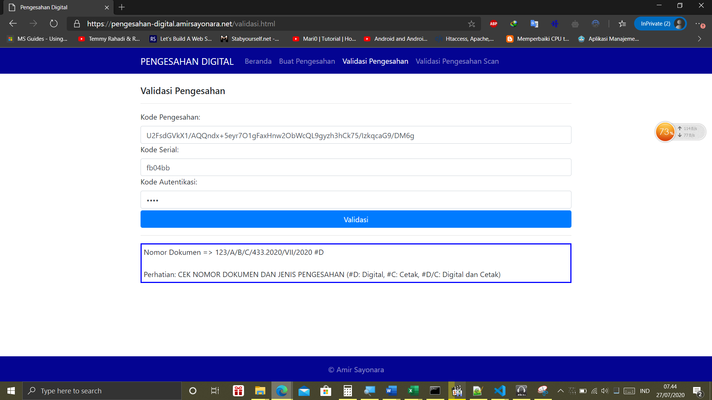
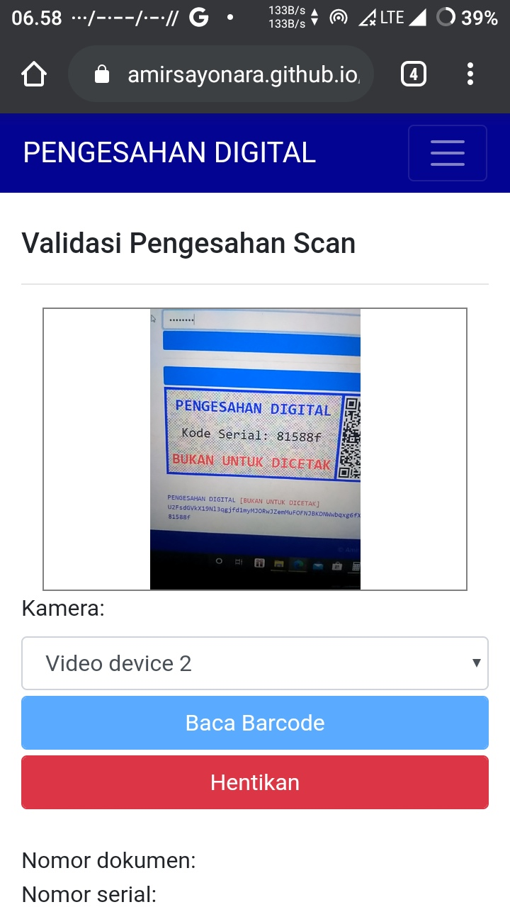
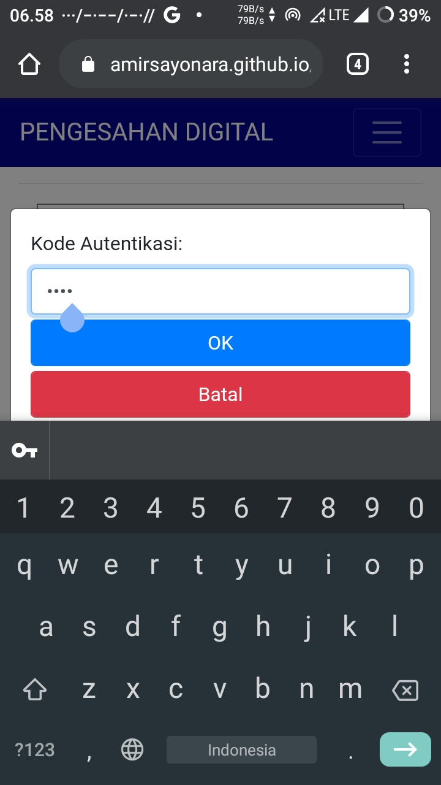
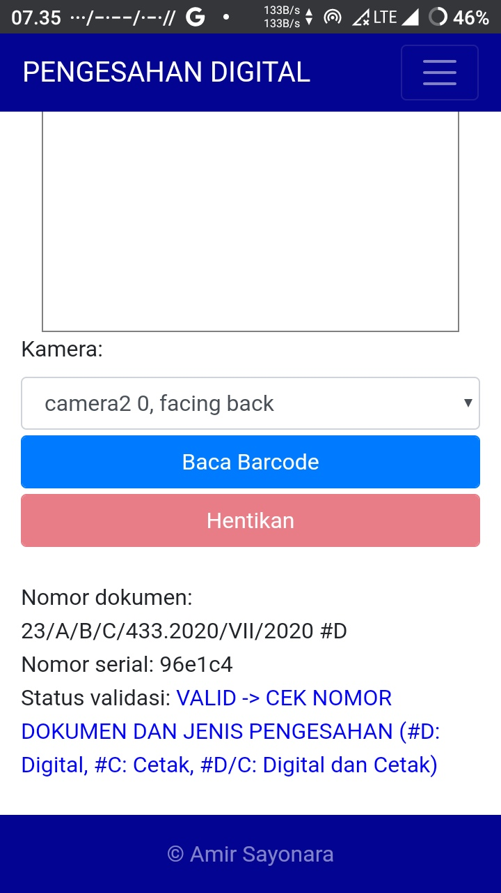

# Pengesahan Digital Online

Pengesahan digital pada dokumen digital atau cetak dengan fitur validasi yang dienkripsi menggunakan AES dan SHA512.

[Gambar Demo ada di bagian bawah]

[Copyright (c) 2020 Amir Sayonara](LICENSE)

## Keterangan Isian
- Nomor dokumen: Nomor dokumen yang dikeluarkan lembaga/instansi (contoh: 123/A/B/C/433.2020/VII/2020)
- Kode serial: Kode unik pada setiap kode pengesahan yang dikeluarkan untuk mengantisipasi nomor dokumen yang kebetulan sama
- Kode autentikasi: Kode pengaman (sandi/password) untuk mengenkripsi nomor dokumen sebagai acuan validasi

## Pembuatan
- Akses https://amirsayonara.github.io/pengesahan-digital/buat.html
- Pilih jenis pengesahan (#D: Digital, #C: Cetak, #D/C: Digital dan Cetak
- Isikan nomor dokumen contoh: "123/A/B/C/433.2020/VII/2020"
- Isikan kode serial (maksimal 8 digit, jika dikosongi serial akan mengacak 6 digit)
- Isikan kode autentikasi (isikan "demo" huruf kecil semua untuk demo) [Untuk menambah kode autentikasi khusus untuk Anda, silahkan hubungi saya]
- Klik Buat
- Klik Cetak untuk menyimpan dan tempelkan pada dokumen digital (PDF atau sejenisnya)
- Gambar pengesahan yang dihasilkan berbentuk vektor sehingga tidak akan pecah jika diperbesar
- Jika kesulitan untuk menempelkan gambar pengesahan, maka cukup salin kode pengesahan (contoh: "U2FsdGVkX1/AQQndx+5eyr7O1gFaxHnw2ObWcQL9gyzh3hCk75/IzkqcaG9/DM6g") dan serial (contoh: "fb04bb") lalu tempelkan (paste) pada dokumen digital sebagai bukti bahwa dokumen tersebut sudah mendapat pengesahan dari Anda

## Validasi manual
- Fitur ini digunakan pada saat perangkat tidak terdapat kamera untuk menyalakan scanner
- Akses https://amirsayonara.github.io/pengesahan-digital/verifikasi.html
- Salin kode pengesahan pada dokumen digital atau ketik secara manual jika sudah dicetak dan dokumen digital sudah tidak ada, lalu masukkan pada kolom kode pengesahan, contoh: "U2FsdGVkX1/AQQndx+5eyr7O1gFaxHnw2ObWcQL9gyzh3hCk75/IzkqcaG9/DM6g"
- Salin atau ketik secara manual kode serial lalu masukkan pada kolom kode serial, contoh: "fb04bb"
- Masukkan kode autentikasi, contoh: "demo"
- Klik Validasi
- Jika tidak ada kesalahan, maka akan memunculkan nomor dokumen yang diikuti dengan jenis pengesahan dokumen, silahkan periksa nomor dokumen dan cocokkan tanda jenis pengesahan (#D: Digital, #C: Cetak, #D/C: Digital dan Cetak) di akhir nomor dokumen
- Jika semuanya cocok maka pengesahan dianggap valid untuk dokumen yang bersangkutan

## Validasi menggunakan scanner
- Fitur ini digunakan pada saat perangkat terdapat kamera untuk menyalakan scanner
- Akses https://amirsayonara.github.io/pengesahan-digital/validasi-scan.html
- Pilih kamera (jika menggunakan smartphone biasanya akan ada 2 pilihan kamera depan/belakang)
- Klik Baca Barcode (ijinkan jika ada permintaan untuk mengakses kamera)
- Arahkan kamera ke barcode pengesahan digital
- Jika berhasil membaca barcode maka akan diminta kode autentikasi, contoh: "demo"
- Jika tidak ada kesalahan, maka akan memunculkan nomor dokumen yang diikuti dengan jenis pengesahan dokumen, silahkan periksa nomor dokumen dan cocokkan tanda jenis pengesahan (#D: Digital, #C: Cetak, #D/C: Digital dan Cetak) di akhir nomor dokumen
- Jika semuanya cocok maka pengesahan dianggap valid untuk dokumen yang bersangkutan

## Demo
### [Barcode versi terbaru berwarna biru]

     
